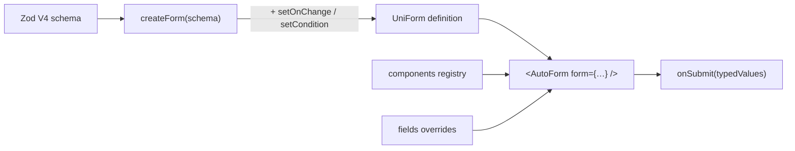

# Building forms with UniForm

UniForm renders a fully-typed, validated React form from a Zod V4 schema. It is **headless**: it introspects the schema, wires `react-hook-form` + `zodResolver` under the hood, and renders inputs — you supply the components and styling. Your job when using this skill is to keep the **schema as the single source of truth** and reach for UniForm's declarative props instead of hand-wiring inputs, `register()` calls, or manual validation.

## Mental model



- **Schema** defines shape, types, and validation.
- **`createForm(schema)`** wraps it into a reusable definition that lives _outside_ React and carries reactive behaviour (`setOnChange`, `setCondition`).
- **`<AutoForm>`** renders it. Presentation (`components`, `fields`, `layout`, `classNames`, `labels`) is layered on at render time — never baked into the schema.

## Setup

```bash
npm install @uniform-ts/core react react-hook-form zod
```

Import the schema builder from the Zod V4 entrypoint and the API from the package root:

```tsx
import * as z from 'zod/v4'
import { AutoForm, createForm } from '@uniform-ts/core'
```

## Default workflow

When asked to build or change a UniForm form, follow this order — it mirrors how the library is designed to be used:

1. **Model the schema first** (`z.object({...})`). Get types and validation right here before touching UI.
2. **Wrap with `createForm(schema)`** if you need reactive behaviour or want to share the definition; otherwise you can pass behaviour inline via `fields`.
3. **Render `<AutoForm form={…} onSubmit={…} />`** and confirm it works with the built-in defaults.
4. **Layer presentation** via `components` (per-type), `fields` (per-field), `layout`, `classNames`, `labels`.
5. **Add reactivity** (`setOnChange`, `setCondition`, conditions) only where behaviour depends on values.

Read [references/component-registry.md](references/component-registry.md), [references/arrays.md](references/arrays.md), and [references/reactivity.md](references/reactivity.md) when a topic below points you there — they carry the deep detail that does not belong in this overview.

## Specialized agents

For larger or multi-stage form work, delegate to the role-specific agents bundled with this skill (under `agents/`). Each owns one responsibility and hands off to the next; together they map onto the default workflow above. Spawn them as subagents, passing the inputs each one documents.

| Agent                | File                                                     | Owns                                                                                              | Delegate when                                                                  |
| -------------------- | -------------------------------------------------------- | ------------------------------------------------------------------------------------------------- | ------------------------------------------------------------------------------ |
| **Schema Architect** | [agents/schema-architect.md](agents/schema-architect.md) | The Zod V4 schema — data shape, validation, enums/unions, array bounds                            | You need to turn requirements into the single-source-of-truth schema (steps 1) |
| **Form Builder**     | [agents/form-builder.md](agents/form-builder.md)         | The render layer — `createForm`/`AutoForm`, `components`, `fields`, conditions, persistence, i18n | You have a schema and need it rendered idiomatically (steps 2–5)               |
| **Form Reviewer**    | [agents/form-reviewer.md](agents/form-reviewer.md)       | Read-only audit — hallucinated APIs, schema-vs-`fields` violations, anti-patterns                 | You're asked to review/fix existing form code, or to self-check output         |

Typical pipeline: **Schema Architect → Form Builder → Form Reviewer.** The Architect keeps data concerns out of the UI, the Builder keeps presentation out of the schema, and the Reviewer guards the boundary between them. For small one-off forms you don't need to split — apply the workflow inline. The agents share this skill's rules, so they stay consistent however you invoke them.

---

## 1. Schema-first design

Define one Zod schema and let UniForm introspect it. Resist the urge to declare a parallel list of "fields" — every input, its type, label-derivation, coercion, and validation rule is read from the schema. A single source of truth means the form and the submitted data type can never drift apart, and `onSubmit` receives values typed as `z.infer<typeof schema>`.

```tsx
import * as z from 'zod/v4'
import { AutoForm, createForm } from '@uniform-ts/core'

const schema = z.object({
  name: z.string().min(1, 'Name is required'),
  email: z.email('Invalid email'),
  role: z.enum(['user', 'admin', 'editor']),
  subscribe: z.boolean(),
})

const contactForm = createForm(schema)

export function ContactForm() {
  return (
    <AutoForm
      form={contactForm}
      defaultValues={{ role: 'user', subscribe: false }}
      onSubmit={(values) => console.log(values)} // values is fully typed
    />
  )
}
```

UniForm understands scalars, `z.enum`/`z.nativeEnum` (rendered as selects), objects (nested fieldsets), arrays of objects (repeating rows), optionals, defaults, and unions. Put validation messages directly in the schema (`z.string().min(1, 'Required')`) so they travel with the data everywhere it is reused.

> Prefer encoding constraints in the schema (`.min`, `.max`, `.email`, `.optional`) over enforcing them in UI code — the schema is what actually validates on submit.

---

## 2. `createForm` vs `createAutoForm`

These solve different problems, and conflating them is the most common UniForm mistake.

- **`createForm(schema)`** binds _one schema_ to its reactive behaviour. Use it whenever you have a form definition — it is where `setOnChange` and `setCondition` live. Returns a `UniForm` you pass as the `form` prop.
- **`createAutoForm(defaults)`** bakes _design-system defaults_ (components, `fieldWrapper`, `layout`, `classNames`, `labels`, `messages`, `coercions`) into a reusable `<AutoForm>` once, so you stop repeating them on every form. It is schema-agnostic and returns a component.

Use them together: `createAutoForm` once per app for your design system, `createForm` per form for the schema.

```tsx
import { createAutoForm, createForm } from '@uniform-ts/core'
import { TextInput, Toggle, SubmitButton } from './design-system'

// Once, app-wide — your branded AutoForm:
export const AppForm = createAutoForm({
  components: { string: TextInput, boolean: Toggle },
  layout: { submitButton: SubmitButton },
  classNames: { form: 'space-y-4' },
})

// Per form — just the schema + behaviour:
const profileForm = createForm(
  z.object({ displayName: z.string().min(1), newsletter: z.boolean() }),
)

export const Profile = () => <AppForm form={profileForm} onSubmit={save} />
```

Factory defaults are deep-merged with instance props (instance wins): `components`, `layout`, `classNames`, `coercions`, `messages`, and `labels` merge; `fieldWrapper` is replaced; `disabled` is OR-ed.

---

## 3. Component registry & overrides

The `components` registry maps a **Zod type key** to your input component, replacing the minimal `defaultRegistry`. Built-in keys: `string`, `number`, `boolean`, `date`, `select` (for enums or a string field with `meta.options`), and `textarea` (opt-in). Your registry is _merged_ with the defaults, so you only override the keys you care about.

```tsx
<AutoForm
  form={myForm}
  components={{ string: MyTextInput, boolean: MyToggle }} // every string/boolean field
  fields={{ bio: { component: MyTextarea } }} // one-off for a single field
  onSubmit={save}
/>
```

Reach for `components` to restyle a _type_ everywhere; reach for `fields[name].component` for a _single field_. You can also add custom keys (`'rating'`, `'slider'`) and point a field at them with `fields={{ score: { component: 'rating' } }}`.

Type every custom component with `FieldProps<Value>` so `value`/`onChange` are correctly typed — for example `FieldProps<number>` for a rating widget:

```tsx
import type { FieldProps } from '@uniform-ts/core'

export function StarRating({ value, onChange, error }: FieldProps<number>) {
  return (
    <div>
      {[1, 2, 3, 4, 5].map((star) => (
        <button type='button' key={star} onClick={() => onChange(star)}>
          {(Number(value) || 0) >= star ? '★' : '☆'}
        </button>
      ))}
      {error && <p className='error'>{error}</p>}
    </div>
  )
}
```

**Read [references/component-registry.md](references/component-registry.md)** for the full `FieldProps` contract, registry resolution order, the `schema` escape hatch (inspect the raw Zod schema), and how plain `z.union()` fields collapse to their first variant for rendering while still validating against the full union.

---

## 4. Field overrides

The `fields` prop customises presentation and behaviour per field using **dot-notated paths** — without touching the schema. This keeps the schema clean (it is about data, not UI) and lets the same schema render differently in different contexts.

> **Rule of thumb — schema vs `fields`:** if it _constrains or describes the data_ (types, `.min`/`.max`, `.email`, enum values, or `meta.options` that turns a string into a select), put it in the **schema** so it travels everywhere the schema is reused. If it is _appearance or layout for this particular form_ (labels, placeholders, `span`, `section`, `order`, which component renders), put it in **`fields`**. When in doubt, prefer `fields` — it is the per-render override layer and wins over introspected config, so the same canonical schema can render differently on each surface.
>
> Note: `meta.options` is the one schema-side exception because it _changes the field's data shape_ (a plain string becomes a constrained set of choices). **Choosing which component renders a field is presentation, not data** — keep that in `fields` (`fields={{ score: { component: 'rating' } }}`), not in schema `meta`. Although `.meta({ component: '…' })` does work, routing component selection through the schema couples your data model to a specific design system and defeats the "same schema, different surfaces" goal.

```tsx
<AutoForm
  form={myForm}
  fields={{
    email: { label: 'Work Email', description: 'We never share it', span: 12 },
    role: { order: 0, section: 'Account' },
    'address.zip': { label: 'ZIP code', span: 4 }, // nested path
    plan: {
      options: [
        // relabel enum options without changing the schema
        { value: 'free', label: 'Free — $0/mo' },
        { value: 'pro', label: 'Pro — $12/mo' },
      ],
    },
  }}
  onSubmit={save}
/>
```

Common keys: `label`, `description`, `placeholder`, `order` (lower renders first), `span` (1–12 grid columns), `section` (group into a named section), `hidden`, `disabled`, `component`, `options`, `condition`, `onChange`, and the array-only `movable`/`duplicable`/`collapsible`/`wrapper`.

**Sections**: give several fields the same `section` string to group them under one wrapper (`<fieldset>`/`<legend>` by default). Fields without a section render first; sections render in first-encounter order. Override the wrapper globally via `layout.sectionWrapper`, or per-section via `layout.sections[name]`.

```tsx
fields={{
  firstName: { section: 'Personal' },
  lastName:  { section: 'Personal' },
  email:     { section: 'Contact' },
}}
```

---

## 5. Conditional fields

Show or hide fields reactively based on current values. Prefer this over conditionally rendering JSX yourself — UniForm **unregisters** a hidden field, so its value leaves the submitted object and its validation stops running; when it reappears, the previous value is restored.

Two ways, same effect:

```tsx
// Inline, for simple one-offs — via the fields prop:
<AutoForm
  fields={{
    vatNumber: { condition: (values) => values.accountType === 'business' },
  }}
  ...
/>

// Centralised, when logic is shared or you want behaviour outside the tree:
const accountForm = createForm(schema)
accountForm.setCondition('vatNumber', (v) => v.accountType === 'business')
accountForm.setCondition('companyName', (v) => v.accountType === 'business')
```

Use `setCondition` (via `createForm`) when the logic is shared across multiple `<AutoForm>` instances or you want all form behaviour colocated outside the component. Use inline `condition` for a quick single rule.

**Row-local sibling conditions**: when the path points into an array (e.g. `'tasks.note'`), the predicate receives the **current row's values**, so you write natural sibling conditions without knowing the row index. Each row evaluates independently.

```ts
// `row` is typed as the array item — { priority, note, … }
taskForm.setCondition('tasks.note', (row) => row.priority === 'high')
```

For **discriminated unions** (`z.discriminatedUnion`), you usually need _no_ conditions at all — UniForm flattens the variants and shows only the active one automatically. See [references/reactivity.md](references/reactivity.md#discriminated-unions).

**Read [references/reactivity.md](references/reactivity.md)** for `setOnChange` (cascading dropdowns, async lookups), row-scoped `setFieldMeta`, row-specific `arrayName.index.field` handlers, and discriminated unions.

---

## 6. Array fields

`z.array(z.object({...}))` renders as a repeating group with Add/Remove/Move row controls out of the box. UniForm reads `.min(n)`/`.max(n)` straight off the schema — the Add button hides at max, and the last row cannot be removed below min — so enforce array bounds in the **schema**, not in UI code.

```tsx
const schema = z.object({
  members: z
    .array(z.object({ name: z.string().min(1), email: z.email() }))
    .min(1, 'Add at least one member')
    .max(10),
})

<AutoForm
  form={createForm(schema)}
  defaultValues={{ members: [{ name: '', email: '' }] }}
  fields={{ members: { label: 'Team', duplicable: true, collapsible: true } }}
  onSubmit={save}
/>
```

> Array rows must be `z.object(...)`. Arrays of primitives (`z.array(z.string())`) are not rendered as repeating fields — use a custom component for those.

For **external controls** (an Add button in a toolbar, a sticky footer count), call `useArrayField(path)` from any component rendered inside `<AutoForm>`. It returns every `useFieldArray` action plus `rowCount`, `canAdd` (false at max), and `atMin` (true at min), all synced to the schema's bounds:

```tsx
import { useArrayField } from '@uniform-ts/core'

function Toolbar() {
  const { append, canAdd, rowCount } = useArrayField('lineItems')
  return (
    <button
      type='button'
      disabled={!canAdd}
      onClick={() => append({ name: '' })}
    >
      Add item ({rowCount})
    </button>
  )
}
```

**Read [references/arrays.md](references/arrays.md)** for custom row layouts (`arrayRowLayout`), Add-button positioning (`arrayFieldLayout`), swapping array button components (`arrayButtons`), and nested-array dot paths.

---

## 7. Validation

Validation is Zod's job — UniForm runs your schema through `zodResolver` and surfaces the messages. Author messages in the schema first; override presentation with the **`messages`** prop only when you need different wording in a specific form or for i18n.

```tsx
<AutoForm
  form={myForm}
  messages={{
    required: 'This field is required', // global required override
    email: 'Please enter a valid email', // replace all errors on `email`
    username: {
      // per-code overrides
      too_small: 'At least 3 characters',
      too_big: 'At most 20 characters',
    },
  }}
  onSubmit={save}
/>
```

Resolution priority per error: per-field string → per-field per-code → global `messages.required` → the schema's own message → Zod's default. Common codes: `too_small`, `too_big`, `invalid_type`, `invalid_string`, `invalid_enum_value`.

**Async validation** comes for free: `onSubmit` may return a `Promise`, and `formState.isSubmitting` is forwarded to the submit button slot so you can disable it / show a spinner.

```tsx
<AutoForm
  form={myForm}
  onSubmit={async (values) => {
    await api.save(values)
  }}
/>
```

For **server-side errors** (e.g. "email already taken" discovered after submit), push them back onto fields imperatively with `setErrors` via the ref (see section 8):

```tsx
formRef.current?.setErrors({ email: 'Email already registered' })
```

---

## 8. Programmatic control

Attach a `ref` typed as `AutoFormHandle<typeof schema>` to drive the form from outside its tree — fill values, read state, submit, reset, focus, or set/clear errors. The handle is exactly `FormMethods`.

```tsx
import { useRef } from 'react'
import type { AutoFormHandle } from '@uniform-ts/core'

const formRef = useRef<AutoFormHandle<typeof schema>>(null)

<AutoForm ref={formRef} form={myForm} onSubmit={save} />

// Anywhere:
formRef.current?.setValues({ name: 'Alice', email: 'alice@example.com' })
formRef.current?.reset()              // back to defaults
formRef.current?.submit()            // trigger submit + validation
formRef.current?.getValues()         // read current values
formRef.current?.focus('email')      // focus a field by name
formRef.current?.setErrors({ email: 'Taken' })
```

Methods: `setValue`, `setValues`, `getValues`, `watch`, `reset`, `resetField`, `setError`, `setErrors`, `clearErrors`, `submit`, `focus`. For array mutations from _inside_ the tree, prefer `useArrayField` (section 6) over the ref.

---

## 9. Persistence

Add `persistKey` to auto-save form state and re-hydrate it on remount — useful for long forms and drafts. On a successful submit the stored value is cleared automatically.

```tsx
<AutoForm
  form={draftForm}
  persistKey='compose-draft'
  persistDebounce={200}
  onSubmit={send}
/>
```

The default storage is **`sessionStorage`** (cleared when the tab closes). To survive tab closes, pass `persistStorage={localStorage}`. Any synchronous adapter implementing `getItem`/`setItem`/`removeItem` works — handy for namespacing keys per user or an in-memory store in tests:

```tsx
const userStorage = (userId: string) => ({
  getItem: (k: string) => localStorage.getItem(`user:${userId}:${k}`),
  setItem: (k: string, v: string) => localStorage.setItem(`user:${userId}:${k}`, v),
  removeItem: (k: string) => localStorage.removeItem(`user:${userId}:${k}`),
})

<AutoForm persistKey="invoice-draft" persistStorage={userStorage(user.id)} ... />
```

`persistDebounce` defaults to `300` ms (set `0` to write on every change).

---

## 10. Localization

Override every built-in UI string (button text, aria labels) via the **`labels`** prop. Import a ready-made locale pack from a subpath export — only the locale you import is bundled.

```tsx
import { es } from '@uniform-ts/core/locales/es'
;<AutoForm form={myForm} labels={es} onSubmit={save} />
```

Available packs: `@uniform-ts/core/locales/{en,he,es}`. Locale packs are plain `FormLabels` objects, so spread and override individual keys, or set one once at the factory level so every form inherits it:

```tsx
// Per-instance override on top of a pack:
<AutoForm labels={{ ...es, submit: 'Guardar cambios' }} ... />

// App-wide default via the factory (instance labels still merge on top):
import { he } from '@uniform-ts/core/locales/he'
const AppForm = createAutoForm({ labels: he })
```

Define a custom language by exporting your own `FormLabels` object (keys like `submit`, `arrayAdd`, `arrayRemove`, and the `arrayAria*` aria-label functions). Any omitted key falls back to the English default.
